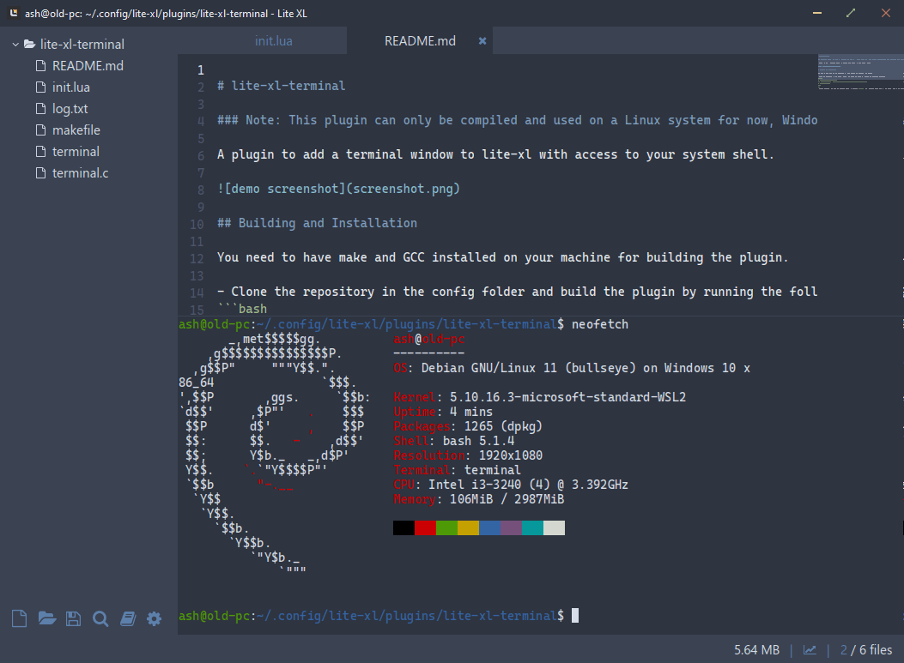

# lite-xl-terminal

### Note: This plugin can only be compiled and used on a Linux system for now, Windows compatibility will hopefully come soon™ (maybe)

A plugin to add a terminal window to lite-xl with access to your system shell.



## Building and Installation

You need to have make and GCC installed on your machine for building the plugin.

- Clone the repository in the config folder and build the plugin by running the following commands:
```bash 
cd ~/.config/lite-xl/plugins
git clone --recursive https://github.com/benjcollins/lite-xl-terminal.git
cd lite-xl-terminal
make
```
- restart lite-xl, and open the terminal window by pressing `Ctrl+t`. The terminal should open in the bottom half of the main window.
